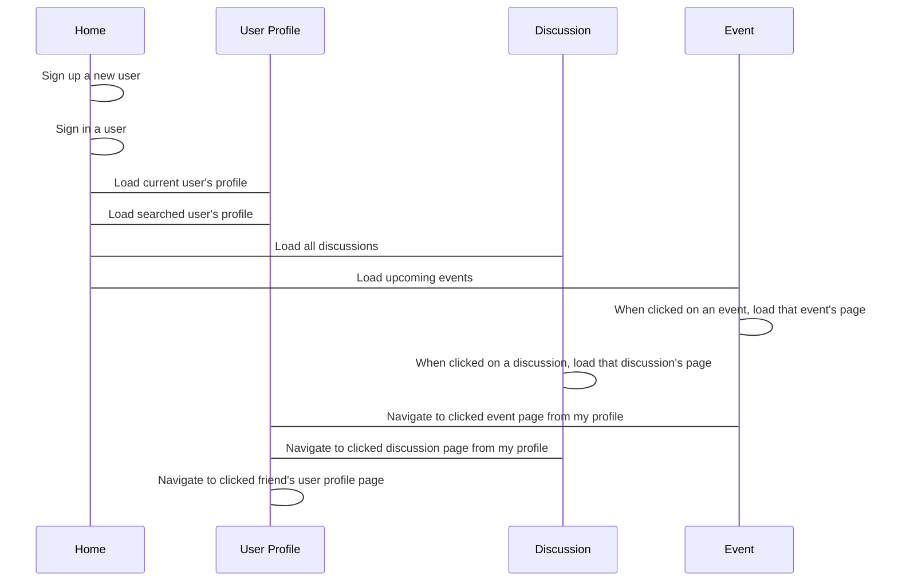

**Welcome to the home of your group's BWA course project code and documentation!**

This file is where your group writes your project plan/project report.

When you write it, you must use Markdown. [Documentation for GitLab Flavored Markdown (GFM)](https://docs.gitlab.com/ee/user/markdown.html).

# Initial project plan document
The headers that must be present in this document are shown here. They were copied here from the course project assignment document.

For instructions on what to add under these headers, see the course project assignment document, [Appendix 2: Initial project plan document](https://docs.google.com/document/d/1iJ4z8dQzUWht0ABX18RXa5Rp8hY76vcMJvBbxODs3PE/edit?usp=sharing#heading=h.m6xhgmo8x8lz)

## Course project group information
Group name: funnysociety

Members:

    Khang Le Thanh - 281657 - khang.lethanh@student.tut.fi

    Christopher Allen - 262541 - allen@student.tut.fi

    Chathura Yapa 272515 kotugode@student.tut.fi

Gitlab URL: https://course-gitlab.tut.fi/bwa-2018/bwa-group006

Heroku URL: https://funnysocietyapp.herokuapp.com
## Must have features

|Order|Feature/Design|Estimated completion date|
|:----|-------|-------------------------|
|1|Base modules|07.11.2018|
|2|Base views|09.11.2018|
|3|Base templates|11.11.2018|
|4|Homer page|13.11.2018|
|5|User page|15.11.2018|
|6|User groups|17.11.2018|
|6|Friend requests component|19.11.2018|
|6|Profile status component|20.11.2018|
|7|Comment component|22.11.2018|
|8|Events page & events components|25.11.2018|
|9|Discussion page & discussion components|28.11.2018|
|10|Events & Discussion integration to profile|02.12.2018|
|11|Events & Discussion integration to profile|04.12.2018|
|12|Overrall testing|06.12.2018|

## Planned +2 features

|Order|Feature/Design|Estimated completion date|
|:----|-------|-------------------------|
|1|Users, Events, Discusisons are searchable|29.11.2018|
|2|Email validation on sign up|15.11.2018|
|3|User password reset|18.11.2018|
|4|Use POSTGRESQL |01.11.2018|

## Pages and navigation

1 Overall website  navigation :

Below diagram illustrates the main navigation points between Home page, User profile page,  Discussion page and events page.

## Technological considerations
    
### Django apps in your Django project

Our Django app  is funnysociety

### Needed Django models and their attributes
User

### URIs
Heroku URL https://funnysocietyapp.herokuapp.com/
web page URLS will follow the following naming convention:
.../events -each event will have its own seperate page
.../events?eventId=1234 - each event page has its own ID
.../discussions -discussions will be on sepearate pages
.../discussions?Id=1234 -ID for discussion pages
.../profile - profile for users 
.../profile?Id=1234 -ID for user profiles
.../home -main page of website
.../home/signUp - page where new users can register
.../home/signIn - page where current users can log in
### Needed Django views and templates

### Heroku deployment
Heroku app link: https://funnysocietyapp.herokuapp.com
We create a shared-login in heroku app, so everyone can use it for deploying the heroku app. We will deploy 3 times per week.
## Testing
    
    Usabiility test
	We will test the app with multiple users. The goal of the usability test is to validata that our app is following the standard usability criteria
 	For example, users should be able to know how to navigate between pages without a hassle, Users know what each button
	does and what every term used means just by looking at it. The sessions will be done with multiple users where they are recorded (with their consent) using the system and feedback will be taken from that.
    Functionality tests
	Internally, the group members will  test each of the functionalities,
	if one gorup member develops a functionality then the other two will perform
	tests on that function
    Performance tests
	We will test the website on different operating systems and browsers
	e.g. Windows, Mac and Linux.The screen reoslutions will also be taken into consideration
    Compatibility tests
       The website will be checked on browserstack tool to see if all of the features we have planned
	will work on different browsers.
    
## Project timetable and division of work
|Order|Page|Feature|Khang|Christopher|Chathura|Deadline|
|:----|----|-------|-----|-----------|-----|-----|
|1|Database|Creating models.py|-|-|Chathura|-|
|2|HerokuApp|Creating Heroku account/ Deploying in herokuapp|Khang|-|-|-|
|3|Home Page|Sign up/ Sign in--|-|-|-|-|
|4|Profile page|Name,Username,Phonenumber,Date of birth, Validation email--|-|-|-|-|
|5|Profile page|Status(comments)-------------------------|-|-|-|-|
|6|Profile page|Request list(sent requests/ received requests)|-|-|-|-|
|7|Profile page|2 buttons for request(ok/decline: notify sender)|-|-|-|-|
|8|Discussion page|Discussion(delete/leave)|-|-|-|-|
|9|Profile page|Displayed discussion links|-|-|-|-|
|10|Profile page|2 buttons for events: Created - Invited|-|-|-|-|
|11|Created-event-page|Name, description, evente category, duration, place, 2 buttons: create-cancel|-|-|-|-|
|12|A events-page|Displayed all events links|-|-|-|-|
|13|Event page|Show event info, invite friend by admin, invte friend by user in the events|-|-|-|-|
>>>
_`The Django project in this repo (bwa2018djangoproject), was created for the groups using Heroku Django Starter Template. The information about it left here for educational purposes. The groups are free to remove this text and all the text below it from this file.`_
# Heroku Django Starter Template

An utterly fantastic project starter template for Django 2.0.

## Features

- Production-ready configuration for Static Files, Database Settings, Gunicorn, etc.
- Enhancements to Django's static file serving functionality via WhiteNoise.
- Latest Python 3.6 runtime environment.

## How to Use

To use this project, follow these steps:

1. Create your working environment.
2. Install Django (`$ pipenv install django`)
3. Create a new project using this template

## Creating Your Project

Using this template to create a new Django app is easy::

    $ django-admin.py startproject --template=https://github.com/heroku/heroku-django-template/archive/master.zip --name=Procfile helloworld

(If this doesn't work on windows, replace `django-admin.py` with `django-admin`)

You can replace ``helloworld`` with your desired project name.

## Deployment to Heroku

    $ git init
    $ git add -A
    $ git commit -m "Initial commit"

    $ heroku create
    $ git push heroku master

    $ heroku run python manage.py migrate

See also, a [ready-made application](https://github.com/heroku/python-getting-started), ready to deploy.

## License: MIT

## Further Reading

- [Gunicorn](https://warehouse.python.org/project/gunicorn/)
- [WhiteNoise](https://warehouse.python.org/project/whitenoise/)
- [dj-database-url](https://warehouse.python.org/project/dj-database-url/)

>>>
