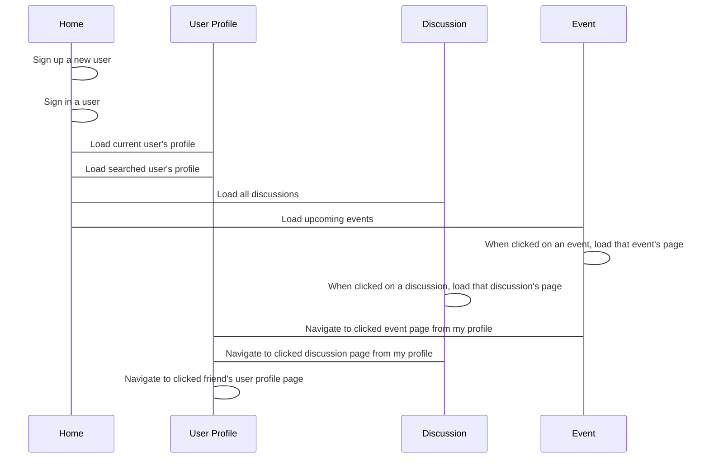

**Welcome to the home of your group's BWA course project code and documentation!**

This file is where your group writes your project plan/project report.

When you write it, you must use Markdown. [Documentation for GitLab Flavored Markdown (GFM)](https://docs.gitlab.com/ee/user/markdown.html).

# Initial project plan document
The headers that must be present in this document are shown here. They were copied here from the course project assignment document.

For instructions on what to add under these headers, see the course project assignment document, [Appendix 2: Initial project plan document](https://docs.google.com/document/d/1iJ4z8dQzUWht0ABX18RXa5Rp8hY76vcMJvBbxODs3PE/edit?usp=sharing#heading=h.m6xhgmo8x8lz)

## Course project group information
Khang Le Thanh - 281657 - khang.lethanh@student.tut.fi
Christopher Allen - 262541 - allen@student.tut.fi
Chathura Yapa 272515 kotugode@student.tut.fi
Group name: funnysociety
Gitlab URL: https://course-gitlab.tut.fi/bwa-2018/bwa-group006
Heroku URL: https://funnysocietyapp.herokuapp.com
## Must have features

|Order|Feature/Design|Estimated completion date|
|:----|-------|-------------------------|
|1|Base modules|07.11.2018|
|2|Base views|09.11.2018|
|3|Base templates|11.11.2018|
|4|Homer page|13.11.2018|
|5|User page|15.11.2018|
|6|User groups|17.11.2018|
|6|Friend requests component|19.11.2018|
|6|Profile status component|20.11.2018|
|7|Comment component|22.11.2018|
|8|Events page & events components|25.11.2018|
|9|Discussion page & discussion components|28.11.2018|
|10|Events & Discussion integration to profile|02.12.2018|
|11|Events & Discussion integration to profile|04.12.2018|
|12|Overrall testing|06.12.2018|

## Planned +2 features

|Order|Feature/Design|Estimated completion date|
|:----|-------|-------------------------|
|1|Users, Events, Discusisons are searchable|29.11.2018|
|1|Email validation on sign up|15.11.2018|
|1|User password reset|18.11.2018|

## Pages and navigation

1 Overall website  navigation :

Below diagram illustrates the main navigation points between Home page, User profile page,  Discussion page and events page.

## Technological considerations
    
### Django apps in your Django project
Our Django app  is funnysociety
Django database
Django whitenoise
Django Pillow
Django psycopg2
Django setuptools
### Needed Django models and their attributes
User

### URIs
Heroku URL https://funnysocietyapp.herokuapp.com/
web page URLS will follow the following naming convention:
.../discussion
.../event/(event no.)
.../profile/(username)
.../home
### Needed Django views and templates

### Heroku deployment
Heroku app link: https://funnysocietyapp.herokuapp.com
All members in our group will use it. We will deploy it 2 times per week.
## Testing
    Django test
    Usabiility test
    Functionality tests
    Performance tests
    Compatibility tests
    
    
## Project timetable and division of work
|Order|Page|Feature|Khang|Christopher|Chathura|Deadline|
|:----|----|-------|-----|-----------|-----|-----|
|1|Database|Creating models.py|-|-|-|-|
|2|Profile page|Name,Username,Phonenumber,Date of birth, Validation email--|-|-|-|-|
|3|Profile page|Status(comments)-------------------------|-|-|-|-|
|4|Profile page|Request list(sent requests/ received requests)|-|-|-|-|
|5|Profile page|2 buttons for request(ok/decline: notify sender)|-|-|-|-|
|6|Discussion page|Discussion(delete/leave)|-|-|-|-|
|7|Profile page|Displayed discussion links|-|-|-|-|
|8|Profile page|2 buttons for events: Created - Invited|-|-|-|-|
|9|Created-event-page|Name, description, evente category, duration, place, 2 buttons: create-cancel|-|-|-|-|
|10|A events-page|Displayed all events links|-|-|-|-|
|11|Event page|Show event info, invite friend by admin, invte friend by user in the events|-|-|-|-|
>>>
_`The Django project in this repo (bwa2018djangoproject), was created for the groups using Heroku Django Starter Template. The information about it left here for educational purposes. The groups are free to remove this text and all the text below it from this file.`_
# Heroku Django Starter Template

An utterly fantastic project starter template for Django 2.0.

## Features

- Production-ready configuration for Static Files, Database Settings, Gunicorn, etc.
- Enhancements to Django's static file serving functionality via WhiteNoise.
- Latest Python 3.6 runtime environment.

## How to Use

To use this project, follow these steps:

1. Create your working environment.
2. Install Django (`$ pipenv install django`)
3. Create a new project using this template

## Creating Your Project

Using this template to create a new Django app is easy::

    $ django-admin.py startproject --template=https://github.com/heroku/heroku-django-template/archive/master.zip --name=Procfile helloworld

(If this doesn't work on windows, replace `django-admin.py` with `django-admin`)

You can replace ``helloworld`` with your desired project name.

## Deployment to Heroku

    $ git init
    $ git add -A
    $ git commit -m "Initial commit"

    $ heroku create
    $ git push heroku master

    $ heroku run python manage.py migrate

See also, a [ready-made application](https://github.com/heroku/python-getting-started), ready to deploy.

## License: MIT

## Further Reading

- [Gunicorn](https://warehouse.python.org/project/gunicorn/)
- [WhiteNoise](https://warehouse.python.org/project/whitenoise/)
- [dj-database-url](https://warehouse.python.org/project/dj-database-url/)

>>>
